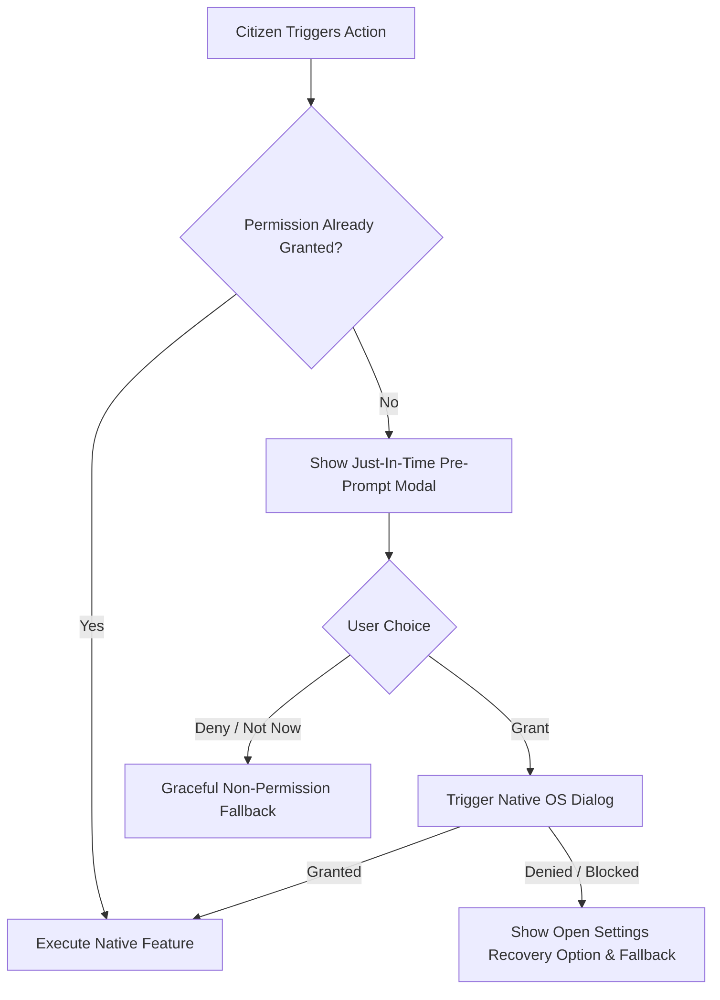

# Universal Device Compatibility & Comprehensive Data-Handling Specification

> [!IMPORTANT]
> **Legal Review Notice**: The expanded Privacy Policy and Terms of Service detailed in this document and implemented in [legalText.ts](file:///d:/MapMyCity/crowdsense-app/src/config/legalText.ts) constitute a comprehensive, structured draft aligned with India's **Digital Personal Data Protection (DPDP) Act, 2023** and the **IT Intermediary Guidelines Rules, 2021**. Prior to public production deployment, this draft should undergo formal sign-off by qualified legal counsel.

---

## 1. Universal Device Compatibility Matrix

The application's design system has been audited and enhanced with dynamic layout adapters ([useResponsive.ts](file:///d:/MapMyCity/crowdsense-app/src/hooks/useResponsive.ts)) that scale seamlessly across device classes without fixed pixel degradation.

| Device Profile | Viewport Width | Layout Mode | UI Adaptation Strategy |
|---|---|---|---|
| **Small Low-End Phone** (~5.0") | `< 360dp` | Single-column Stack | Compact cards, condensed padding, full-width category buttons, Lite Mode optimizations enabled. |
| **Standard Phone** (~6.0–6.5") | `360dp – 767dp` | Single-column Stack | 2-column category grid, Gorhom bottom sheets for map marker inspection, fluid safe-area spacing. |
| **Phablet / Large Phone** | `428dp+` | Single-column Fluid | Enhanced touch targets, expanded photo previews, dynamic font scaling support. |
| **Tablet (Portrait)** | `768dp – 1023dp` | Master-Detail Split | **Master-Detail Layout**: Interactive map canvas on left; persistent 380px issue inspection panel on right. 3-column category grid. |
| **Tablet / Foldable (Landscape)** | `1024dp+` | Master-Detail Wide | Multi-column dashboard, side-by-side before/after photo comparisons, full persistent timeline views. |

### Safe Area & Orientation Safeguards
- **Orientation**: Unlocked to `"default"` in [app.json](file:///d:/MapMyCity/crowdsense-app/app.json) to support tablet and landscape framing of wide road damage.
- **Insets Awareness**: All floating action buttons (FABs), filter chips, and bottom sheets dynamically respect `insets.top` and `insets.bottom` to avoid notch, punch-hole, and gesture bar collisions across iOS and Android.

---

## 2. Device Resource Permission & Fallback Map

All device permissions follow a **Just-In-Time (JIT)** request pattern with pre-prompt explanations ([PermissionPromptModal.tsx](file:///d:/MapMyCity/crowdsense-app/src/components/PermissionPromptModal.tsx)) and zero-permission fallback routes.

### Resource Permission Fallback Specification

| Resource Type | Native Permission | Justification Displayed to User | Graceful Fallback on Denial | Settings Recovery |
|---|---|---|---|---|
| **Camera** | `CAMERA` / `NSCameraUsageDescription` | "CrowdSense uses your camera to capture high-clarity photos of road hazards, potholes, and civic issues." | **Photo Library Picker**: Citizen can pick existing photo from gallery. | Deep-link to OS settings via `Linking.openSettings()` |
| **Photo Library** | `READ_MEDIA_IMAGES` / `NSPhotoLibraryUsageDescription` | "Allows you to select previously captured photos of civic infrastructure issues to attach to your report." | **Camera Capture or Text Report**: Citizen can take live photo or submit text-only report. | Deep-link to OS settings |
| **Location (Foreground)** | `ACCESS_FINE_LOCATION`, `ACCESS_COARSE_LOCATION` / `NSLocationWhenInUseUsageDescription` | "Used to automatically pin the precise GPS coordinates of civic hazards and show nearby alerts in your ward." | **Manual Map Pinning**: Citizen can pan, zoom, and drag a pin to designate the issue location. | Deep-link to OS settings |
| **Microphone** | `RECORD_AUDIO` / `NSMicrophoneUsageDescription` | "Allows you to speak your issue description. Audio is processed 100% on-device and raw sound is never uploaded." | **Manual Keyboard & Picker**: Citizen types notes and selects category manually. | Deep-link to OS settings |

> [!NOTE]
> **No Background Location**: The application strictly avoids declaring `ACCESS_BACKGROUND_LOCATION` or `UIBackgroundModes: ["location"]`. Geofenced alert targeting relies solely on ephemeral in-session coordinates.

---

## 3. Comprehensive Data-Handling & DPDP Act Disclosure

### Data Inventory & Retention Schedule

| Data Category | Purpose & Usage | Storage & Encryption Standard | Retention Period | Sharing with Partners |
|---|---|---|---|---|
| **Phone Number** | Account identity & anti-abuse rate limiting | Irreversible SHA-256 hash with unique salt. Plaintext never stored. | Lifetime of active account; permanently erased upon account deletion. | **Never shared** with municipal or NGO partners. |
| **Precise GPS Location** | Pinpointing defect coordinates for municipal repair work | PostGIS spatial tables with Row-Level Security (RLS). | Retained indefinitely as public civic infrastructure data (decoupled from user identity on deletion). | Public map display; Municipal Public Works teams. |
| **Last-Known Location** | Ward hazard alert targeting | Ephemeral in-memory working buffer. | Session only; discarded upon session end. No movement history recorded. | None (processed transiently). |
| **Photographs** | Visual verification & contractor repair work orders | Cloudinary encrypted CDN storage. | Retained for public verification until issue resolution. Policy-rejected photos purged immediately. | Public map display; Municipal maintenance contractors. |
| **Voice Audio** | Speech transcription for report notes | 100% on-device processing via Whisper.cpp / local ASR. | **Zero server retention**. Raw audio never leaves mobile device. | None (audio is strictly on-device). |
| **Safety Concerns** | Documenting harassment or broken streetlight hazards | Anonymized safety tables; reporter UUID stripped from public views. | Retained in aggregated heatmap form. | Municipal Safety & Police Planning authorities. |

---

## 4. Third-Party Sub-Processors

| Sub-Processor | Function | Data Transferred | Data Center Location |
|---|---|---|---|
| **Supabase Inc.** | PostgreSQL Database, User Auth & RLS | Hashed phone numbers, encrypted profile metadata, submission coordinates | AWS Mumbai (`ap-south-1`), India |
| **Cloudinary Ltd.** | Image storage, resizing & CDN delivery | Public civic issue photographs and resolution proofs | Encrypted Cloud Storage (India Edge) |
| **Sightengine SAS** | Automated NSFW & violence moderation | Image binary for transient pre-upload safety inspection (not retained) | Secure Processing API |
| **Twilio / Telecom Gateway** | One-Time Password (OTP) delivery | Phone number (transient during SMS transit) | Telecom Gateway |

---

## 5. Citizen Data Rights under India's DPDP Act, 2023

1. **Right to Access & Data Portability**: Citizens can trigger `Profile Settings → Export My Data` to download a complete, structured JSON export of their personal profile and submission history.
2. **Right to Erasure (Account Deletion)**: Citizens can trigger `Profile Settings → Delete Account & Personal Data`. The backend deletes the user profile and phone hash from all databases within 30 days while keeping civic issue coordinates unlinked as public infrastructure data.
3. **Right to Grievance Redressal**: Contact the designated Nodal Grievance Officer:
   - **Officer**: Nodal Compliance & Grievance Officer
   - **Email**: `grievance@mapmycity.org`
   - **Address**: CrowdSense Platform, IT Park, Bengaluru, Karnataka 560001
   - **Timelines**: Acknowledgment within 24 hours; resolution within 15 calendar days under IT Intermediary Guidelines Rules 2021.
