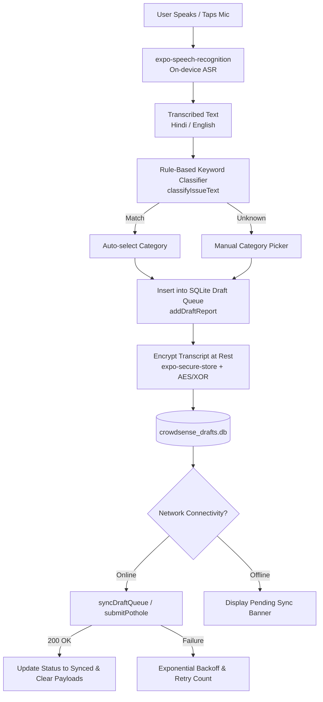

# Voice-First & Offline-First Reporting Architecture (`OFFLINE_VOICE.md`)

This document describes the voice-first, offline-first reporting architecture in **MapMyCity (CrowdSense)** (`crowdsense-app`). It allows citizens—especially low-literacy users—to report civic issues by speaking instead of typing, while guaranteeing that offline reports are encrypted locally and automatically synchronized when connectivity returns.

---

## 🏗️ Architecture Overview

### Key Principles
1. **On-Device Privacy & Speech Processing**: Raw audio never leaves the device. Transcriptions occur locally via native OS Speech engines (`SpeechRecognizer` / `SFSpeechRecognizer`).
2. **Local-First Persistence**: All user reports (voice or manual) are stored directly into local SQLite storage FIRST (`addDraftReport`) before attempting network operations. The user interface never blocks on slow network conditions.
3. **Encrypted Storage at Rest**: Transcripts stored in `crowdsense_drafts.db` are encrypted using symmetric keys stored in `expo-secure-store`.
4. **Lightweight Footprint**: Zero large LLM downloads required during app installation.

---

## 🗄️ Local SQLite Schema & Sync Lifecycle

### SQLite Table (`draft_submissions`)

| Column | Type | Description |
|---|---|---|
| `id` | `TEXT PRIMARY KEY` | Unique draft identifier (`draft_<timestamp>_<rand>`). |
| `photo_uri` | `TEXT` | Local file URI of compressed photo. |
| `transcript` | `TEXT` | Encrypted Base64 transcript payload. |
| `category` | `TEXT` | Issue category (`pothole`, `garbage`, `noise`, `accessibility`, `infrastructure`). |
| `latitude` | `REAL` | High-accuracy GPS latitude. |
| `longitude` | `REAL` | High-accuracy GPS longitude. |
| `captured_at` | `TEXT` | ISO-8601 timestamp string. |
| `status` | `TEXT` | Draft lifecycle state (`queued`, `syncing`, `failed`, `synced`). |
| `retry_count` | `INTEGER` | Sync attempt counter (capped at 5 attempts). |
| `last_error` | `TEXT` | Diagnostic error string on network failure. |

### Sync Manager & Exponential Backoff ([`localQueue.ts`](file:///d:/MapMyCity/crowdsense-app/src/services/localQueue.ts))
- **Trigger**: Automatic network listener in [`useDraftSync.ts`](file:///d:/MapMyCity/crowdsense-app/src/hooks/useDraftSync.ts) runs every 15 seconds or upon app open.
- **Success Action**: Upon 200 OK response from `/submissions`, the record status is updated to `synced` and local URI / transcript payloads are cleared to bound device storage.
- **Retry Policy**: Failed attempts increment `retry_count` and log `last_error`. After 5 consecutive retries, items are marked `failed` for user review.

---

## 🔌 Future ML Modular Swap Points

The architecture is built with clean interfaces to allow swapping lightweight algorithms with on-device ML models in future releases:

### 1. Automatic Speech Recognition (ASR) Swap Point
- **Location**: [`src/services/speech.ts`](file:///d:/MapMyCity/crowdsense-app/src/services/speech.ts)
- **Interface**: `transcribeAudio(audioUri: string): Promise<string>`
- **Future Integration**: Replace native speech recognition with `whisper.cpp` or bundled TFLite ASR models without modifying UI components.

### 2. Category Classification Swap Point
- **Location**: [`src/services/classifier.ts`](file:///d:/MapMyCity/crowdsense-app/src/services/classifier.ts)
- **Interface**: `classifyIssueText(text: string): MissionTypeId | 'unknown'`
- **Future Integration**: Replace keyword rules with an on-device TFLite or ONNX text embedding classifier without touching caller components.

---

## 🧪 Airplane Mode Testing Walkthrough

Follow these steps to test offline draft queueing and automatic network synchronization:

### Step 1: Prepare the App & Enable Airplane Mode
1. Launch `crowdsense-app` (`npx expo start`).
2. Open the app on your mobile device via **Expo Go**.
3. Turn **ON Airplane Mode** (or disable Wi-Fi and Cellular Data) on your phone.

### Step 2: Record an Issue Offline
1. Tap the **"Report an Issue"** tab.
2. Notice the voice mic option or select a category (e.g. **Pothole**).
3. Snap a photo of the issue.
4. Tap the **"Speak"** button or enter notes ("Large pothole near main gate").
5. Tap **"Submit Report"**.

### Step 3: Verify Local Offline Queueing
1. Observe the success confirmation toast: **"Saved Offline! Report saved safely. Will auto-sync when online."**
2. Look at the top of the screen: A blue persistent banner displays **"1 report waiting to sync"**.

### Step 4: Re-enable Connectivity & Verify Auto-Sync
1. Turn **OFF Airplane Mode** (reconnect Wi-Fi or Cellular Data).
2. Within 15 seconds (or upon tapping the sync banner), the background sync manager detects connection.
3. The report is transmitted to the backend endpoint (`/submissions`).
4. The pending sync banner automatically disappears once receipt is confirmed by the backend!
