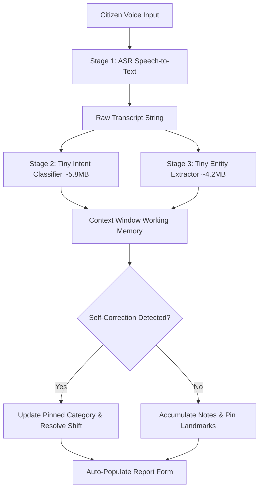

# On-Device Machine Learning Models & Pipeline Architecture

This document defines the on-device machine learning strategy for **MapMyCity (CrowdSense)**. It details model footprint targets, pipeline execution topologies, context memory bounds, and explicit boundaries between on-device and server-side ML.

---

## 1. Core Scoping Principles & Footprint Limits

- **Target Footprint**: ~10–20MB maximum per model. Total on-device ML footprint $\le$ 35MB across all downloaded weights.
- **Task-Specific Tiny Models**: Rather than attempting to run a single monolithic Small Language Model (SLM) that exceeds mobile RAM and produces unpredictable generative outputs, on-device intelligence is composed of a **chain of tiny, specialized models** (ASR $\rightarrow$ Intent Classifier $\rightarrow$ Extractive Span Selector $\rightarrow$ Bounded Translator).
- **Bounded Working Memory**: Ephemeral sliding-window context buffer (`ContextWindow.ts`) strictly caps session memory (max 5 turns, max 500 characters) with separate pinned slots for immutable facts.
- **Zero Base Bundle Bloat**: No model weights are bundled in the base APK/AAB. Models download on-demand with instant rule-based fallback.
- **Lite Mode & Low-RAM Degradation**: On low-RAM devices ($\le$2GB RAM) or when Lite Mode is active, execution immediately drops to deterministic rule-based algorithms with 0ms delay.

---

## 2. On-Device Model Registry Matrix

| Model Identifier | Task / Stage | Format & Architecture | Footprint | Trigger Point | Fallback Mechanism |
|---|---|---|---|---|---|
| `voice_asr` | Speech-to-text transcription | TFLite / Whisper.cpp tiny | **8.0 MB** | Voice capture recording | Native OS Speech API or typing |
| `voice_intent_classifier` | Intent & Category classification | Distilled Transformer / CNN | **5.8 MB** | ASR transcript completion | Multilingual keyword rule matcher |
| `voice_entity_extractor` | Extractive span / qualifier selector | Tiny Token Span Extractor | **4.2 MB** | Post-intent voice analysis | Regex & heuristic span extractor |
| `phrase_translator_tiny` | Bounded phrase translation (<150 chars) | Quantized Seq2Seq / Lookup | **12.5 MB** | Dynamic moderator remarks | Static i18n template dictionary |
| `category_verifier_yolo` | Visual hazard object verification | YOLOv8n INT8 | **3.2 MB** | Camera capture confirmation | Direct upload to human triage |
| `nsfw_detector` | Client-side explicit content filter | MobileNet INT8 | **1.8 MB** | Pre-upload image check | Server-side moderation pipeline |
| `image_embedding_extractor`| Spatial duplicate embedding extractor | MobileNet INT8 | **2.5 MB** | Pre-upload cluster check | GPS distance thresholding |

---

## 3. Pipeline Architecture: Chain of Tiny Models

Instead of an SLM, the voice capture flow executes as an extensible, multi-stage pipeline:

### Self-Correction & Context Resolution
- When a user corrects themselves (e.g., *"Wait, actually it's garbage not a pothole"*), `voiceIntentClassifier` inspects the active `ContextWindow` pinned state.
- The pipeline seamlessly updates the pinned category from `pothole` $\rightarrow$ `garbage` and logs the correction without growing the history buffer.

---

## 4. What Stays On-Device vs. What Stays Off-Device

To ensure reliable performance on low-cost devices and maintain architectural honesty, the following boundary is strictly enforced:

### ✅ Stays On-Device (Tiny / Task-Specific)
- **Utterance Classification**: Mapping citizen speech to fixed mission categories (`pothole`, `garbage`, `infrastructure`, etc.).
- **Extractive Span Selection**: Pulling exact phrases from speech for notes (e.g., *"huge"*, *"near the signal"*, *"water leaking"*).
- **Short-Segment Phrase Translation**: Translating status updates under 150 characters with domain-specific vocabulary.
- **Pre-Upload Safety & Visual Checks**: Nano YOLO and NSFW filtering before network transmission.
- **Sliding-Window Working Context**: Session-scoped rolling memory discarded upon report submission.

### ❌ Stays Off-Device (Server-Side Only)
- **Generative Text Creation**: Drafting full sentences from scratch, summarizing long citizen threads, or free-form chatbots.
- **Large-Scale Spatial Clustering**: DBSCAN and Delaunay triangulation across tens of thousands of city coordinates.
- **Road Hazard Index (RHI) Aggregation**: Heavy spatial decay and municipal analytics across historical datasets.
- **Model Training & Continuous Fine-Tuning**: Supervised dataset distillation, quantization, and evaluation.

---

## 5. Sliding-Window Context Specifications (`ContextWindow.ts`)

- **Max Turns**: `5` rolling exchanges.
- **Max Characters**: `500` characters total rolling transcript.
- **Eviction Strategy**: First-In-First-Out (FIFO) eviction of oldest rolling turns.
- **Pinned State**: Explicit slots (`selectedCategory`, `landmark`, `severity`, `notes`) survive all evictions.
- **Lifecycle**: Purely in-memory; completely cleared via `clear()` upon submission or screen unmount.

---

## 6. Testing, Validation & Telemetry

- **Validation Test Suite**: Full coverage across `ContextWindow`, `voicePipeline`, `voiceIntentClassifier`, `voiceEntityExtractor`, and `tinyPhraseTranslator`.
- **Low-End Hardware Simulation**: Verified execution with zero memory leaks and bounded RAM allocation.
- **Fallback Rate Telemetry**: `pipelineTelemetry.ts` tracks aggregate model utilization vs. fallback rates without collecting PII or audio.
