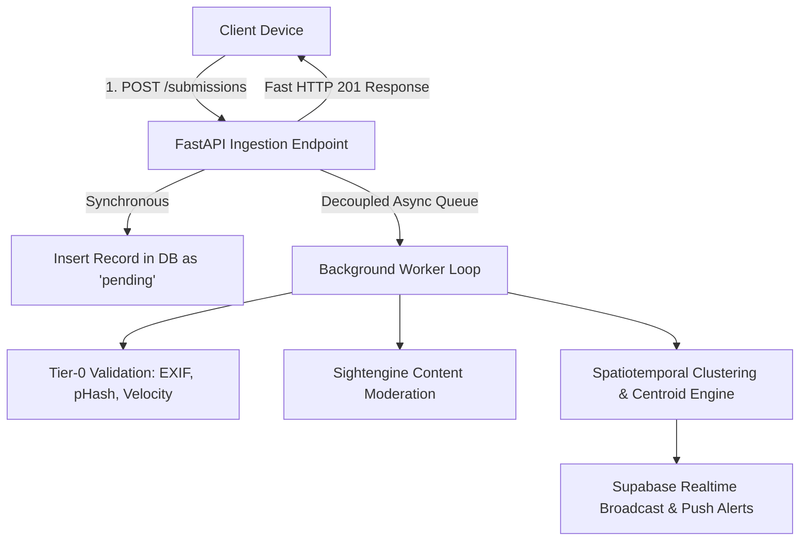

# Real-Time Engagement & Scale Architecture (`REALTIME_AND_SCALE.md`)

This document outlines the real-time engagement layer and backend scale/reliability refactor for **MapMyCity (CrowdSense)**. It explains synchronous vs. queued ingestion, real-time presence/map updates, live hazard alert layers, read-replica database routing, and the feature flag rollout framework.

---

## ⚡ Synchronous vs. Queued Architecture

### 1. Synchronous Path (Sub-100ms Client Response)
- **Ingestion**: `POST /submissions` validates basic parameters, writes the submission row with status `pending`, and returns HTTP `201 Created` immediately.
- **Benefits**: Eliminates upload timeouts during low-bandwidth network conditions (e.g. 2G/3G in monsoon conditions).

### 2. Async Queued Path ([`workers/background_queue.py`](file:///d:/MapMyCity/backend-fastapi/workers/background_queue.py))
- **Tier-0 Validations**: Downloads image header asynchronously, extracts EXIF metadata, checks pHash Hamming distance, and evaluates velocity limits.
- **Sightengine Moderation**: Asynchronously calls image moderation APIs without holding open client HTTP connections.
- **Batch Centroid Engine**: PostGIS `ST_Centroid` calculations run in background batch intervals (every 2 minutes or N reports), preventing database lock contention under spiky load.

---

## 📡 Real-Time vs. Polled Data Streams

| Component | Protocol / Mechanism | Description |
|---|---|---|
| **Live Map Pins** | **Supabase Realtime Postgres Changes** | Listens to `INSERT` & `UPDATE` on `submissions` / `clusters`. Map pins update live without polling. |
| **Viewport Presence** | **Supabase Realtime Presence Channels** | Tracks active map viewers per ward (`"X people viewing this area right now"`). |
| **Push Alerts** | **Expo Push Service + Supabase Edge Functions** | Triggers instant notifications when cluster status transitions (`acknowledged → in_progress → resolved`). |
| **Hazard Alerts** | **Direct Geo-Proximity Broadcast** | Emergency hazards (`waterlogging`, `road_closure`) trigger instant push notifications to users in affected GPS bounds. |

---

## 🌊 Live Hazard & Public Safety Layer

- **Fast, Photo-Free Reporting**: Hazards (`waterlogging`, `road_closure`, `signal_down`, `fallen_tree`) do not require photos, allowing citizens to broadcast emergency hazards in seconds during storm/flooding events.
- **Auto-Expiry Engine**: Hazards automatically expire after **3 hours** unless re-confirmed by nearby reports, keeping map views clean.
- **Visually Distinct Layer**: Hazards render with distinct red hazard badges and expiration indicators.

---

## 🚩 Feature Flag Rollout Framework ([`services/feature_flags.py`](file:///d:/MapMyCity/backend-fastapi/services/feature_flags.py))

Feature flags enable staged rollouts per ward or city before full deployment:

| Flag Name | Default | Purpose |
|---|---|---|
| `live_hazard_layer` | `true` | Controls emergency hazard reporting layer. |
| `status_timeline_v1` | `true` | Enables staged delivery-tracking timeline. |
| `social_upvotes` | `true` | Enables "Me too, still an issue" upvoting. |
| `presence_channels` | `true` | Controls viewport presence viewer counters. |

---

## 🗄️ Read Replica & API Rate Limiting

- **Read Replica Separation ([`database_read.py`](file:///d:/MapMyCity/backend-fastapi/database_read.py))**: Route map queries (`GET /submissions`, `GET /clusters`, `GET /hazards`) to dedicated read replicas, protecting primary database write performance.
- **API Rate Limiting ([`middleware/rate_limit.py`](file:///d:/MapMyCity/backend-fastapi/middleware/rate_limit.py))**: Sliding-window rate limiter (60 requests/minute/IP) preventing scripted API abuse.
