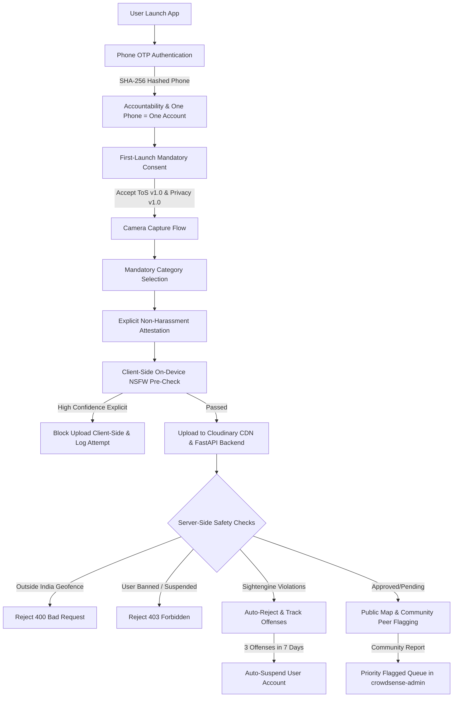

# Trust, Safety & Governance Architecture (`SAFETY_AND_AUTH.md`)

This document outlines the production-ready Trust, Safety, Authentication, and Compliance architecture for **MapMyCity (CrowdSense)**. It addresses real-world scale risks in the Indian market—such as malicious spam, fake reports, harassment, defamatory content targeting individuals, and legal compliance under India's **Information Technology (Intermediary Guidelines and Digital Media Ethics Code) Rules, 2021** and **DPDP Act 2023**.

---

## 🛡️ Multi-Layered Trust & Safety Architecture

---

## 📱 Part 1: Phone-Based Authentication & Account Accountability

### 1. Human-Tied Trust Anchor
Email authentication has low adoption in the Indian mass market. Phone number verification via OTP serves as the universal trust anchor (similar to Swiggy, Ola, and PhonePe), ensuring 1 human = 1 account.

### 2. Privacy-Preserving Cryptographic Hashing (`phone_hash`)
- **No Raw Phone Numbers in DB**: Mobile numbers are normalized (+91...) and hashed using **SHA-256** (`Crypto.digestStringAsync`) with a salt prior to storage.
- **Accountability**: If a user is banned for malicious reports or harassment, the `phone_hash` is permanently blocked (`is_banned = TRUE`), preventing re-registration even if the device is reinstalled.

### 3. Rate-Limiting & Anti-Abuse
- OTP requests are capped at **3 per hour per phone hash** to defend against SMS-bombing and enumeration attacks.

---

## ⚖️ Part 2: Terms of Service, Privacy & IT Rules 2021 Compliance

### 1. Mandatory Blocking Consent (`ConsentScreen.tsx`)
- Users cannot access main reporting features without accepting the **Terms of Service** and **Privacy Policy**.
- Consent acceptance is recorded in the `user_consent` database table with `tos_version`, `privacy_version`, and UTC timestamp.

### 2. Legal Grounding & Defamation Warnings
- Explicit prohibition of harassment, defamation, or filing false reports against neighbors, shopkeepers, or political workers.
- Clear warning of potential legal liability under Indian Penal Code (IPC) / Bharatiya Nyaya Sanhita (BNS) and the Information Technology Act, 2000 for defamatory submissions.

### 3. Nodal Grievance Redressal Mechanism
- Pursuant to Rule 3(2) of the **IT Intermediary Rules, 2021**, users can access the **"Report a Legal Concern"** modal in-app to contact the designated Nodal Grievance Officer:
  - **Email:** `grievance@mapmycity.org`
  - **Response SLA:** Acknowledged within 24 hours; resolved within 15 days.

---

## 📸 Part 3: Mandatory Pre-Check & Attestation Flow

### 1. Category Tagging at Capture Time
- Immediately after photo capture, the app requires category selection (`pothole`, `garbage`, `noise`, `accessibility`, `infrastructure`). This step cannot be skipped.

### 2. Explicit Attestation Checkbox
- Tappable checkbox: *"I confirm this photo is a genuine civic issue and does not contain people, private property without consent, or inappropriate content"*.
- The submit button remains disabled until this box is checked.

### 3. On-Device Client-Side Image Pre-Check ([`nsfwFilter.ts`](file:///d:/MapMyCity/crowdsense-app/src/services/nsfwFilter.ts))
- Runs an instant on-device pre-check before uploading assets to Cloudinary.
- Blocks explicit/inappropriate content on the client device, saving CDN & Sightengine API costs.

### 4. Escalating Server-Side Account Auto-Suspension
- If a user incurs **3 Sightengine content policy rejections** (`auto_rejected_content_policy`) within a 7-day rolling window:
  - The system automatically updates `is_banned = TRUE` and sets `suspension_reason = 'Auto-suspended: Multiple content policy violations'`.

---

## 🚩 Part 4: Community Peer Flagging & Admin Priority Queue

### 1. In-App Peer Reporting ([`MapScreen.tsx`](file:///d:/MapMyCity/crowdsense-app/src/screens/MapScreen.tsx))
- Citizens can report any public pin with specific options:
  - `not_real`: Not a real civic issue
  - `inappropriate`: Inappropriate or explicit content
  - `duplicate`: Duplicate report
  - `targets_person_property`: Targets a person or private property

### 2. Admin Priority Flagged Queue ([`crowdsense-admin`](file:///d:/MapMyCity/crowdsense-admin/src/app/page.tsx))
- Submissions reported by peers are surfaced in a dedicated **Priority Flagged Queue** in the administrative dashboard for immediate review and removal.
- Includes direct user account suspension controls by `phone_hash` or `user_id`.

---

## 🌐 Part 5: Anti-Abuse Guardrails

### 1. Geofencing Sanity Check
- Backend checks coordinates: Latitude must be between `6.0°` and `37.5°`, Longitude between `68.0°` and `97.5°` (India territory). Rejects out-of-bounds junk test coordinates with `400 Bad Request`.

### 2. User Velocity Limits
- Enforces a 5 submissions/hour quota per authenticated `user_id`, defending against automated bot farms.
