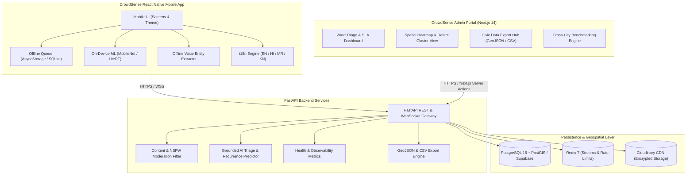
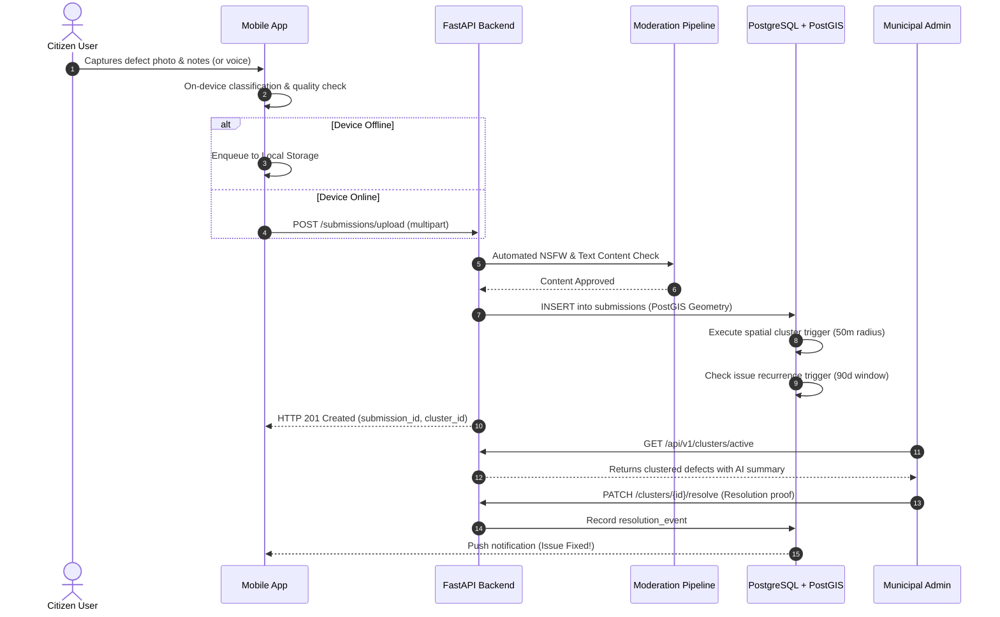

# MapMyCity (CrowdSense) — System Architecture

This document provides a comprehensive technical reference for the MapMyCity / CrowdSense platform architecture, data flows, subsystem boundaries, and security model.

---

## 1. High-Level Architecture Diagram

---

## 2. End-to-End Submission Lifecycle

---

## 3. Subsystem Breakdown

### 3.1 Mobile Client (`crowdsense-app`)
* **Framework**: React Native (Expo SDK 51+), TypeScript.
* **Offline-First Protocol**: Zero data loss guarantee. Captures are timestamped with high-accuracy GPS and preserved locally until network connectivity is restored.
* **On-Device Inference**: MobileNetV3 / quantized LiteRT models verify category relevance before network upload.
* **Multilingual Localization**: Native support for English, Hindi, Marathi, and Kannada (`i18n.ts`).

### 3.2 Backend Service (`backend-fastapi`)
* **Framework**: FastAPI with async SQLAlchemy and Pydantic v2.
* **Spatial Processing**: Direct PostGIS ST_DWithin and ST_Distance calculations for real-time spatial clustering.
* **AI Assistance Layer**: Non-hallucinatory grounded triage summarizer, recurrence risk scoring, and citizen note enhancement.
* **Telemetry & Health**: Comprehensive `/api/v1/health/detailed` and `/api/v1/telemetry/metrics` endpoints.

### 3.3 Database & GIS Layer (`database/migrations`)
* **PostGIS 3.3+**: Geospatial indexes (`GIST(location)`) on coordinates for sub-10ms spatial queries.
* **Recurrence Engine**: Trigger-based recurrence detector tracking temporary contractor patches and chronic defect hotspots.
* **Row-Level Security (RLS)**: Enforces citizen privacy and role-based municipal officer access.

---

## 4. API Precondition Gate Architecture
Speculative future features remain gated behind explicit precondition checks documented in `FUTURE_BACKLOG.md`:
* **Multi-Device Sessions**: Gated on `MULTI_DEVICE_ENABLED`.
* **Public Aggregate API**: Gated on `PUBLIC_API_ENABLED` (requires 500+ verified submissions across 3+ wards).
* **Volunteer/NGO Task Board**: Gated on `TASK_BOARD_ENABLED` (requires signed partner MoU).

---

## 5. Security & Privacy Safeguards
1. **Zero Citizen Identifiers in Public Exports**: All GeoJSON/CSV exports strip user and device IDs.
2. **Rate Limiting**: Sliding window token bucket algorithms prevent scraping and DDoS attacks.
3. **Automated Content Moderation**: Blocks malicious or abusive image and text uploads before insertion.
